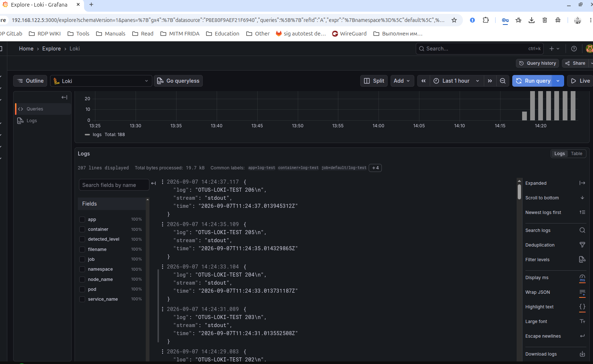

# Kubernetes Logging

Домашнее задание по централизованному сбору логов в Kubernetes с использованием Grafana Loki, Promtail и Grafana.

## Цель

Настроить централизованный сбор и просмотр логов приложений Kubernetes:

- развернуть Loki;
- использовать S3-совместимое объектное хранилище для Loki;
- настроить Promtail для сбора логов с Kubernetes-ноды;
- подключить Grafana к Loki;
- проверить получение логов контейнеров через Grafana Explore.

## Структура

```text
kubernetes-logging/
├── README.md
├── grafana-loki.png
├── grafana-values.yaml
├── loki-values.yaml
└── promtail-values.yaml
```

## Архитектура

В тестовом окружении используется Minikube с одной Kubernetes-нодой.

Схема сбора логов:

```text
Kubernetes Pods
      |
      v
   Promtail
      |
      v
 Loki Gateway
      |
      v
     Loki
      |
      v
 MinIO (S3)

Grafana
   |
   v
 Loki Gateway
```

Promtail работает как DaemonSet и собирает логи контейнеров с Kubernetes-ноды.

Loki работает в режиме Single Binary.

Для хранения данных Loki используется MinIO как S3-совместимое объектное хранилище.

Grafana подключена к Loki через внутренний Kubernetes Service.

## Helm repositories

Добавлен Helm-репозиторий Grafana:

```bash
helm repo add grafana https://grafana.github.io/helm-charts
helm repo update
```

Используемые версии Helm charts:

```text
grafana/loki       7.3.0
grafana/promtail   6.17.1
grafana/grafana    10.5.15
```

## Namespace

Все компоненты централизованного логирования устанавливаются в namespace `logging`.

Namespace создаётся автоматически при установке Loki:

```bash
helm upgrade --install loki grafana/loki \
  --version 7.3.0 \
  --namespace logging \
  --create-namespace \
  -f loki-values.yaml
```

---

# Loki

## Конфигурация

Файл `loki-values.yaml`:

```yaml
deploymentMode: SingleBinary

loki:
  auth_enabled: false

  commonConfig:
    replication_factor: 1

  schemaConfig:
    configs:
      - from: "2024-04-01"
        store: tsdb
        object_store: s3
        schema: v13
        index:
          prefix: loki_index_
          period: 24h

  limits_config:
    allow_structured_metadata: true
    volume_enabled: true

singleBinary:
  replicas: 1

  persistence:
    enabled: true
    size: 1Gi
    storageClass: standard

backend:
  replicas: 0

read:
  replicas: 0

write:
  replicas: 0

ingester:
  replicas: 0

querier:
  replicas: 0

queryFrontend:
  replicas: 0

queryScheduler:
  replicas: 0

distributor:
  replicas: 0

compactor:
  replicas: 0

indexGateway:
  replicas: 0

bloomPlanner:
  replicas: 0

bloomBuilder:
  replicas: 0

bloomGateway:
  replicas: 0

minio:
  enabled: true

  image:
    repository: minio/minio
    tag: RELEASE.2023-09-30T07-02-29Z
    pullPolicy: IfNotPresent

  mcImage:
    repository: minio/mc
    tag: RELEASE.2023-09-29T16-41-22Z
    pullPolicy: IfNotPresent

  persistence:
    size: 1Gi

chunksCache:
  enabled: false

resultsCache:
  enabled: false

lokiCanary:
  enabled: false

gateway:
  enabled: true

test:
  enabled: false
```

Loki настроен в режиме Single Binary, так как для выполнения домашнего задания используется небольшой однодовый Minikube-кластер.

Replication factor установлен в `1`:

```yaml
commonConfig:
  replication_factor: 1
```

Для хранения используется S3:

```yaml
schemaConfig:
  configs:
    - store: tsdb
      object_store: s3
      schema: v13
```

В качестве S3-совместимого хранилища используется MinIO.

## Особенность тестового окружения

Современный MinIO image, используемый Helm chart по умолчанию, не запускался на CPU тестового стенда:

```text
Fatal glibc error: CPU does not support x86-64-v2
```

Поэтому для MinIO и MinIO Client используются более ранние версии образов:

```yaml
image:
  repository: minio/minio
  tag: RELEASE.2023-09-30T07-02-29Z

mcImage:
  repository: minio/mc
  tag: RELEASE.2023-09-29T16-41-22Z
```

## Установка Loki

Проверка Helm template:

```bash
helm template loki grafana/loki \
  --version 7.3.0 \
  -n logging \
  -f loki-values.yaml > /tmp/loki.yaml
```

Установка:

```bash
helm upgrade --install loki grafana/loki \
  --version 7.3.0 \
  --namespace logging \
  --create-namespace \
  -f loki-values.yaml
```

Проверка:

```bash
kubectl get pods -n logging
```

После установки:

```text
loki-0                           2/2   Running
loki-gateway-...                 1/1   Running
loki-minio-0                     1/1   Running
```

Таким образом, Loki, Loki Gateway и S3-совместимое хранилище MinIO успешно запущены.

---

# Promtail

Promtail используется для сбора логов Kubernetes-контейнеров.

Он развёрнут как DaemonSet, поэтому экземпляр Promtail запускается на каждой Kubernetes-ноде.

## Конфигурация

Файл `promtail-values.yaml`:

```yaml
config:
  clients:
    - url: http://loki-gateway.logging.svc.cluster.local/loki/api/v1/push

  snippets:
    pipelineStages:
      - cri: {}

daemonset:
  enabled: true

deployment:
  enabled: false

serviceMonitor:
  enabled: false

tolerations:
  - operator: Exists
```

Promtail отправляет собранные логи через Loki Gateway:

```text
http://loki-gateway.logging.svc.cluster.local/loki/api/v1/push
```

`tolerations` разрешает DaemonSet запускаться в том числе на нодах с taint:

```yaml
tolerations:
  - operator: Exists
```

## Установка Promtail

Проверка Helm template:

```bash
helm template promtail grafana/promtail \
  --version 6.17.1 \
  -n logging \
  -f promtail-values.yaml > /tmp/promtail.yaml
```

Установка:

```bash
helm upgrade --install promtail grafana/promtail \
  --version 6.17.1 \
  --namespace logging \
  -f promtail-values.yaml
```

Проверка DaemonSet:

```bash
kubectl rollout status daemonset/promtail -n logging
```

Результат:

```text
daemon set "promtail" successfully rolled out
```

Проверка:

```bash
kubectl get daemonset -n logging
```

Для однодового Minikube-кластера:

```text
NAME       DESIRED   CURRENT   READY   UP-TO-DATE   AVAILABLE
promtail   1         1         1       1            1
```

---

# Проверка Promtail и Loki

Для проверки был создан тестовый pod, постоянно генерирующий сообщения в stdout:

```bash
kubectl run log-test \
  --image=busybox:1.36 \
  --restart=Never \
  -- sh -c 'i=0; while true; do echo "OTUS-LOKI-TEST $i"; i=$((i+1)); sleep 2; done'
```

Проверка непосредственно через Kubernetes:

```bash
kubectl logs log-test --tail=5
```

Для проверки Loki Gateway выполнялся port-forward:

```bash
kubectl port-forward \
  -n logging \
  svc/loki-gateway \
  3100:80
```

Проверка доступных labels:

```bash
curl -sS \
  http://127.0.0.1:3100/loki/api/v1/labels \
  | python3 -m json.tool
```

Loki возвращает Kubernetes labels:

```text
app
component
container
filename
instance
job
namespace
node_name
pod
service_name
```

После этого выполнен LogQL-запрос непосредственно к API Loki:

```bash
curl -sSG \
  http://127.0.0.1:3100/loki/api/v1/query_range \
  --data-urlencode 'query={namespace="default", pod="log-test"}' \
  --data-urlencode 'limit=20' \
  | python3 -m json.tool
```

Loki успешно вернул поток:

```text
namespace="default"
pod="log-test"
container="log-test"
node_name="minikube"
```

и сообщения:

```text
OTUS-LOKI-TEST 0
OTUS-LOKI-TEST 1
...
```

Это подтверждает работу цепочки:

```text
container stdout
      ↓
Kubernetes node log
      ↓
Promtail
      ↓
Loki Gateway
      ↓
Loki
```

---

# Grafana

Grafana используется для просмотра и поиска логов, хранящихся в Loki.

Datasource Loki создаётся автоматически при установке Grafana.

## Конфигурация

Файл `grafana-values.yaml`:

```yaml
adminUser: admin
adminPassword: admin

service:
  type: ClusterIP

persistence:
  enabled: false

datasources:
  datasources.yaml:
    apiVersion: 1
    datasources:
      - name: Loki
        type: loki
        access: proxy
        url: http://loki-gateway.logging.svc.cluster.local
        isDefault: true

tolerations:
  - operator: Exists
```

Grafana обращается к Loki через внутреннее DNS-имя Kubernetes:

```text
http://loki-gateway.logging.svc.cluster.local
```

## Установка Grafana

Проверка Helm template:

```bash
helm template grafana grafana/grafana \
  --version 10.5.15 \
  -n logging \
  -f grafana-values.yaml > /tmp/grafana.yaml
```

Установка:

```bash
helm upgrade --install grafana grafana/grafana \
  --version 10.5.15 \
  --namespace logging \
  -f grafana-values.yaml
```

Проверка:

```bash
kubectl rollout status deployment/grafana -n logging
kubectl get pods -n logging
kubectl get svc -n logging
```

---

# Доступ к Grafana

Kubernetes-кластер работает на отдельном Linux-сервере в GNS3 без графического интерфейса.

Поэтому Grafana публикуется через `kubectl port-forward` на всех интерфейсах сервера:

```bash
kubectl port-forward \
  --address=0.0.0.0 \
  -n logging \
  svc/grafana \
  3000:80
```

После этого Grafana доступна с рабочей станции через IP Linux-сервера:

```text
http://192.168.122.5:3000
```

Для тестового окружения используются:

```text
login:    admin
password: admin
```

---

# Проверка логов в Grafana

В Grafana открыт раздел:

```text
Explore → Loki
```

Для проверки выполнен LogQL-запрос:

```logql
{namespace="default", pod="log-test"}
```

Grafana успешно получила из Loki сообщения тестового контейнера:

```text
OTUS-LOKI-TEST 203
OTUS-LOKI-TEST 204
OTUS-LOKI-TEST 205
OTUS-LOKI-TEST 206
```

Результат:



Таким образом, Grafana успешно подключена к Loki и позволяет выполнять поиск и просмотр Kubernetes-логов.

---

# Итоговая проверка

Проверка компонентов:

```bash
kubectl get pods -n logging
```

В namespace `logging` запущены:

```text
Loki
Loki Gateway
MinIO
Promtail
Grafana
```

Проверка Promtail:

```bash
kubectl rollout status daemonset/promtail -n logging
```

Проверка Loki выполнялась через API:

```logql
{namespace="default", pod="log-test"}
```

Тот же запрос успешно выполнен через Grafana Explore.

Итоговая схема:

```text
+---------------------+
| Kubernetes Pods     |
| stdout / stderr     |
+----------+----------+
           |
           v
+---------------------+
| Promtail DaemonSet  |
+----------+----------+
           |
           v
+---------------------+
| Loki Gateway        |
+----------+----------+
           |
           v
+---------------------+
| Loki Single Binary  |
+----------+----------+
           |
           v
+---------------------+
| MinIO / S3          |
+---------------------+

           ^
           |
+----------+----------+
| Grafana             |
| Explore / LogQL     |
+---------------------+
```

Централизованный сбор логов Kubernetes настроен и проверен.

Promtail собирает логи контейнеров с Kubernetes-ноды, Loki принимает и обрабатывает их, данные Loki сохраняются в S3-совместимом MinIO, а Grafana используется для поиска и просмотра логов.
